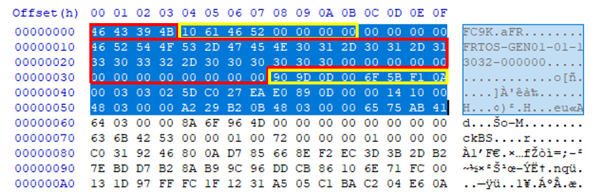

OTA (Over The Air) Update {#ota_update}
============================================================

## Overview

The DA16200 SDK supports OTA (over-the-air) FW(firmware) update with an Http(s) protocol in its library. Users can easily develop the OTA FW update function in the application. OTA FW update consists of Download and Renew functions. DOWNLOAD function is the process of downloading FW from server and is dependent on network status. The RENEW module refers to the process of replacing with a new FW after successful FW download. All the user should do is configure parameters and run a few APIs.

  

## Features

- The DA16200 supports HTTP/HTTPS 1.1. DA16200 requests firmware download to the HTTP-server by using the GET method of the HTTP-client.
- The OTA update application must know the URL of the HTTP-server in advance before requesting a download.
- When using HTTPS, the DA16200 must have at least 36 KB of heap memory for TLS encryption and decryption.
- During the OTA update, the user must control not to enter DPM SLEEP.

## Firmware Version

  
The Figure shows DA16200 header information as an example. Header information is 96 bytes and automatically inserted when firmware is built. Users do not need to understand all the contents of the header. The red box in Figure is the magic number and version information. The yellow box is information for checking firmware CRC. Users only need to understand the version information in the red box.

DA16200's RTOS has unique version rules for system protection. The version name is inserted as a 26-character string in the header part of the firmware image at the time of build.
There are five elements in the version string, separated by "-". These are: Type, Vendor, Major, Minor, and Customer. Ex) FRTOS-GEN01-01-12345-000001

***Type-Vendor-Major-Minor-Customer***
-	Type (4 bytes): Identify the type of firmware.
-	Vendor (5 bytes): Vendor classification  
-	Major (2 bytes): Major number to check compatibility  
-	Minor (4~5 bytes): SDK patch number  
-	Customer (6 bytes): User configurable version  
Type-Vendor-Major determines whether DOWNLOAD or RENEW is compared to the version of firmware currently in operation. Minor-Customer can be used by the user for firmware version management.
Users can change the customer version by editing ..\version\3rd_customer_build_num.h. If users change the customer version and build the SDK, the customer version is applied to the image.

-	File location : `.\version\3rd_customer_build_num.h`

### Update type
- OTA update task is operated based on the type defined in OTA update type. The operation sequence is tailored to the specified type.
| ota_update_type | enum | Description |
|---|:---:|---|
|OTA_TYPE_INIT|0|Operation step of process.|
|OTA_TYPE_RTOS|1|RTOS.|
|OTA_TYPE_MCU_FW|2|MCU firmware, not DA16x.|
|OTA_TYPE_CERT_KEY|3|Certificate or Key.|
|OTA_TYPE_UNKNOWN|4|Unknown value.|

### Structure
- OTA UPDATE CONFIG sets the necessary parameters when calling OTA FW update API.
| Type | Name | Description |
|---|---|---|
| ota_update_type | update_type | Update type. |
| char | uri[HTTP_MAX_RESOURCE] | Pointer variable to the server address where the RTOS exists. |
| void | (*download_notify)(ota_update_type update_type, UINT ret_status, UINT progress) | Callback function pointer to check the download status. |
| void | (*renew_notify)(UINT ret_status) | Callback function pointer to check the renew state. Only for RTOS. |
| void | (*renew_notify)(UINT ret_status) | Callback function pointer to check the renew state. |
| UINT | auto_renew |  If the value is true, if the new firmware download is successful, it will reboot with the new firmware. Only for RTOS. |
| UINT | download_sflash_addr |  Address of sflash where other fw or certificate are stored. Only for MCU_FW and CERT_KEY. |
| UINT | download_sflash_addr |  Address of sflash where other_fw is stored. Only for MCU_FW and CERT_KEY. |

### Result Codes
- All APIs, provided by OTA update return the result codes as shown in the Table. It is delivered through the callback function connected with DOWNLOAD and RENEW API.
| Result Code | Value | Description |
|---|:---:|---|
| `OTA_SUCCESS` | `0x00` | Return success. |
| `OTA_FAILED` | `0x01` | Return failed. |
| `OTA_ERROR_SFLASH_ADDR` | `0x02` | Sflash address is wrong. |
| `OTA_ERROR_TYPE` | `0x03` | FW type is unknown. |
| `OTA_ERROR_URL` | `0x04` | Server URL is unknown. |
| `OTA_ERROR_SIZE` | `0x05` | FW size is too big. |
| `OTA_ERROR_CRC` | `0x06` | CRC is not correct. |
| `OTA_VERSION_UNKNOWN` | `0x07` | FW version is unknown. |
| `OTA_VERSION_INCOMPATI` | `0x08` | FW version is incompatible. |
| `OTA_NOT_FOUND` | `0x09` | Fw not found on the server. |
| `OTA_NOT_CONNECTED` | `0x0A` | Failed to connect to server. |
| `OTA_NOT_ALL_DOWNLOAD` | `0x0B` | All new FWs have not been downloaded. |
| `OTA_MEM_ALLOC_FAILED` | `0x0C` | Failed to alloc memory. |

## APIs
- Start DOWNLOAD
> @ref ota_update_start_download  
- Stop DOWNLOAD  
> @ref ota_update_stop_download  
- Start RENEW
> @ref ota_update_start_renew  
- Get Progress
> @ref ota_update_get_download_progress  
- Get SFLASH Address of Download Area
> @ref ota_update_get_new_sflash_addr
- Read SFLASH Data
> @ref ota_update_read_flash
- Erase SFLASH Data
> @ref ota_update_erase_flash
- Copy SFLASH Data
> @ref ota_update_copy_flash
- Set MCU FW Name
> @ref ota_update_set_mcu_fw_name
- Get MCU FW Name
> @ref ota_update_get_mcu_fw_name
- Get MCU FW Information
> @ref ota_update_get_mcu_fw_info
- Read MCU FW (use UART)
> @ref ota_update_uart_read_mcu_fw
- Transfer MCU FW (use UART)
> @ref ota_update_uart_trans_mcu_fw
- Erase MCU FW saved in sflash.
> @ref ota_update_erase_mcu_fw
- Calculate CRC32 of MCU FW
> @ref ota_update_calcu_mcu_fw_crc
- UART initialization
> @ref ota_update_uart_init
