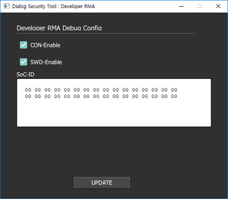

Platform Security Guide for DA16200 (SBTOOL) {#sbtool_guide}
=================================

SBTOOL(Secure Build Tool) is used to generate secret keys, certificates, and secure binary Images for DA16200. \n
The security services that user can do with SBTOOL are:

-   Secure Production (@ref sbtool_secureprod)

-   Key Renewal (@ref sbtool_keyrenewal)

-   Secure Boot (@ref sbtool_secureboot)

-   Secure Debug (@ref sbtool_securedebug)

-   Secure RMA (@ref sbtool_securerma)

After device provisioning, you can use the secret key of the OTP memory to encrypt or decrypt user data in the flash memory. \n
The APIs and services that encrypt, store and decrypt data are:

-   Secure Asset (@ref sbtool_secureasset)

-   Secure Storage (@ref sbtool_securestorage)

-   Secure NVRAM (@ref sbtool_securenvram)

***

Running SBTOOL
==============

When running "CM.1.secuman.bat" from SBOOT folder, the main window is displayed.

ROLE SELECTION
--------------

The secure boot and debug build process is divided into several phases to which a manager is assigned.\n
This manager should generate the own secret key that is used to authenticate
with a line manager for Chain-of-Trust. \n

- **Single**\n
	Top manager who is responsible to generate and manage all secret keys of the product. \n
	Only the Single Manager has the authority to generate, renew or remove the secret keys. \n 
	Most importantly, the private key that corresponds to the RoT (Hbk0 and Hbk1) in the OTP memory
	should be kept and maintained by the Single Manager. \n     
	
- **SB Publisher**\n
	The “SB Publisher" role has to generate the third certificate, i.e. the content certificate,  \n
	which is needed for Secure Boot in a three-level certificate scheme 
	and to rebuild Secure bootable images with it (all UEboot, RTOS, and SLIB images). \n  
	Only the Secure Boot menu is enabled for this role.  \n
	
- **SB/SD Publisher**\n
	The "SB/SD Publisher" role has to generate the third certificate, i.e. the content certificate,  \n
	which is needed for Secure Boot in a three-level certificate scheme 
	and to rebuild Secure Boot images with it (all UEboot, RTOS, and SLIB images). \n  
	In addition, the "SB/SD Publisher" role has to generate the Debug certificate 
	for Secure Debug with the SoC-ID of the target device \n
	enabling the debug interface (JTAG port) of the target device 
	and to rebuild Secure bootable images (only the UEboot image is rebuilt).  \n

REMOVE SECRETS
--------------

>   Top manager(Single) only

When the user wants to have a 3rd party (or developer) debug the end-product in the field, 
the user should run menu Remove Secrets \n
before the SBOOT directory is delivered to the 3rd party (or developer), 
to remove all important secret keys and certificates. 

> Note that before running this menu, 
> the original SBOOT directory should be already backed-up in a safe location 
> because all secret keys will be removed. 

When you use the Remove Secrets menu, a confirmation window shows. 
Select **Yes to All** if you are sure that you want to remove all secrets.

Select a destination role to determine whom SBOOT will be sent and which files to remove accordingly.

back to top, @ref sbtool_guide

***

SECURE PRODUCTION {#sbtool_secureprod}
=================

>   Top manager(Single) only

Secure Production generates all the secret keys such as CM keys, DM keys, and
keys for the 2nd certificate and 3rd certificate. \n
And the certificate chains that use the generated keys are generated 
to make a Secure Boot and Secure Debug image.

Build Process
-------------

When the Secure Production button is clicked on the Security Tool, the
confirmation window appears to prevent that the user removes the files by
mistake.

When the Security Tool is used for the first time, select **Yes to All**. The
Secure Production process starts logging on both the console window and the log
file in the example directory.

After successful Secure Production, files **cmpu.pkg.bin** and **dmpu.pkg.bin**
are in the public directory.

>   Note that **UEboot for the production** (DA16xxx_ueboot.bin.SecureBoot)
>   should be used at production time.

The log messages for Secure Production are saved in file
**secure_production.txt** in the example directory. The procedure or error
messages can be checked with this file.

Run Process
-----------

After the SDK is built, the bootable UEboot image (DA16xxx_ueboot_xxx.img) is
available in the public directory.\n

For the CMPU and DMPU process, all UEboot, RTOS and SLIB images should be
downloaded to SFLASH.  

* Download the porduction version of UEboot image.

~~~
[MROM] loady boot   // porduction version of UEboot image
~~~

* Download the RTOS and SLIB images.

~~~
[MROM] loady a000   // for RTOS image
[MROM] loady f1000  // for SLIB image
~~~

* Power off & on, and then reset.
 
~~~
Power OFF and ON

[DA16200] reset     // to enter into MROM
~~~

* Download the CMPU binary, cmpu.pkg.bin.

~~~
[MROM] loady 1f2000 1000 bin
~~~

* Download the DMPU binary, dmpu.pkg.bin.

~~~
[MROM] loady 1f3000 1000 bin
~~~

* POR Boot and CMPU registration

To write secrets into the OTP memory is implemented in a command in RTOS.\n
Therefore, an RTOS image should be run to provision the secrets in the CMPU and DMPU binaries. \n
The user needs to boot with RTOS. To do so, press the power off/on button, or use the boot command at the MROM prompt. \n
Hbk0 and CM keys can be burned into the OTP memory with the below-mentioned command on the [DA16200]
prompt in RTOS.

~~~
[DA16200] sys.sprod
~~~

When successful, the following message is output:

~~~
    Product.CMPU: 0
~~~

* POR Boot and DMPU registration

After the power off/on is pressed, the LCS of the DA16200 will change from CM LCS to DM LCS. \n
Hbk1 and DM keys can be burned into the OTP memory with command:

~~~
Power OFF and ON

[DA16200] sys.sprod
~~~

When successful, the following message is output:

~~~
    Product.DMPU: 0
~~~

* POR Boot and Verification

After the power off/on button is pressed, the LCS of the DA16200 will change from DM LCS to Secure LCS, \n
in which JTAG is disabled and only enabled again with a Debug Certificate. \n
Once completed, the CMPU and DMPU binary in the flash should be deleted for security reasons. \n
Command sys.sprod will erase the binaries on the flash.

~~~
Power OFF and ON

[DA16200] sys.sprod
~~~

Command sys.sprod will output some messages similar to that shown

~~~
CC_BsvSocIDCompute return SocID
        7D D2 00 E0 F1 06 43 F5 AF 5A 17 3F BF A6 8E 3D
        03 4C B7 DA AA 6D DB 39 51 0B F5 D5 62 7E 2C 8F
Product.CMPU: Erased
Product.DMPU: Erased
Product.SLock: 1
Product.State: Secure Boot Scenario - Good
~~~

After all the above-mentioned procedures are completed, the production version
of UEboot should be replaced with a normal version of UEboot \n
(rename **DA16xxx_ueboot.bin.NoneSecure** to **DA16xxx_ueboot.bin** in the "image" directory and build the SDK) 

Download the image  with the following command at the prompt.

~~~
[MROM] loady boot   // normal version of UEboot image
~~~

back to top, @ref sbtool_guide

***

KEY RENEWAL	{#sbtool_keyrenewal}
===========

>   Top manager(Single) only

When one of the 2nd and 3rd private keys is exposed for any reason, those
private keys need to be changed with the Key Renewal menu.

Be careful and think twice before this menu is used, \n
because after this menu is used, all previously generated 2nd, 3rd private keys 
and certificates are deleted and regenerated from scratch.

>   Note that RoT (1st private key) cannot be changed.

Build Process
-------------

If you click the Key Renewal button in the Security Tool, the confirmation
window displays to prevent that this key renewal action is done by mistake.

To do the key renewal, select **Yes to All**. The previously generated 2nd and
3rd private keys, and the certificates are deleted and regenerated.

The file **key_renewal.txt** in the example directory is a log file for the Key
Renewal process. The file can be used to check the log or read error messages
that occurred.

back to top, @ref sbtool_guide

***

SECURE BOOT {#sbtool_secureboot}
===========

The DA16200 provides a secure boot function that allows trusted images signed
with a key matching the registration information in the system \n
during the boot process to ensure the system's platform integrity.

Build Process
-------------

To generate images for Secure Boot, run the menu item Secure Boot. \n
Secure Boot images with the certificate chain are generated in the public directory.

File **secure_debug.txt** in the example directory is a log file for Secure Boot process.\n 
The file can be used to check the log and read error messages that occurred.

>   After running this process, 
>   UEBOOT image gerneation mode in the IAR build is set to the Secure Boot mode.

back to top, @ref sbtool_guide

***

SECURE DEBUG {#sbtool_securedebug}
============

The debug port in the DA16200 JTAG is disabled by default when entered into
Secure LCS as described before. \n
When this debug port needs to be re-enabled for debug purposes, 
then a Secure Debug image should be used.

Build Process
-------------

When Secure Debug is run in the Security Tool, the configuration window will
display to enter the SoC ID of the target device. \n
Use command sys.socid in the console to check what the SoC-ID is of the target device.

~~~
[DA16200] sys.socid

or

[MROM] socid
~~~

You can copy and paste the SoC-id from the console command to the window and then click UPDATE.

File **secure_debug.txt** in the example directory is a log file for the Secure
Debug process. The file can be used to check the log and read error messages
that occurred.

>   After running this process, UEBOOT image gerneation mode in the IAR build is
>   set to Secure Debug mode.

>   If you are no longer debugging the device, run SECURE-BOOT again to change the mode.

back to top, @ref sbtool_guide

***

SECURE RMA {#sbtool_securerma}
==========

>   Top manager(Single) only

The LCS of the chip should be changed to RMA-LCS before the chip is sent to the
chip maker (i.e. Dialog Semiconductor) for analysis.

A Debug certificate that has an RMA flag enabled (RMA certificate) is required
to enter a device into RMA LCS. \n
In addition, to erase secret keys in the OTP memory, a specific UEBoot binary for RMA is required. \n
This UEboot binary for RMA is provided in the SDK with the name UEboot_XX_RMA_XX.bin. \n
Like Secure Debug, 
Secure RMA is allowed for a specific device and a SoC-ID is required for the RMA certificate.

Build Process
-------------

When running Secure RMA, the configuration window will display to enter the
SoC-ID in the RMA certificate for the target device. \n
Copy and paste the SoC-ID from console to the window and then click UPDATE.

> When this process is complete, run SECURE-BOOT again to change to the mode that can support other devices.

~~~
[DA16200] sys.socid

or 

[MROM] socid
~~~

File **secure_rma.txt** in the example directory is a log file for the Secure RMA process. \n 
The file can be used to check the log and read error messages that occurred.

Run Process
-----------

There are two images with an RMA certificate generated in the public directory:
**DA16xxx_rma.img** and **DA16xxx_rma_icv.img**.

After UEboot for RMA to the Sflash is updated, do the following steps for the RMA process.

* Download the RMA version of UEboot image.

~~~
[MROM] loady boot [RMA version of UEboot]
~~~

* Download the RMA cetificate iamge, **DA16xxx_rma.img** used to erase DM keys.

~~~
[MROM] loady 1f2000 1000 bin
~~~

* Run the following commands to erase DM keys.

~~~
[MROM] sbrom sflash 1f2000

Power OFF and ON    // for POR
~~~

* Download the RMA cetificate iamge, **DA16xxx_rma_icv.img** used to erase CM keys.

~~~
[MROM] loady 1f2000 1000 bin
~~~

* Run the following commands to erase CM keys.

~~~
[MROM] sbrom sflash 1f2000

Power OFF and ON    // for POR
~~~

To check if the device entered properly into RMA, use command sys.socid.  \n 
After the above steps are done, the normal version UEBoot image should be in place again on the Sflash.

~~~
[MROM] loady boot [Normal version of UEboot]
~~~

back to top, @ref sbtool_guide

***

SECURE ASSET {#sbtool_secureasset}
==========

>   Top manager(Single) only

Secure assets are encrypted data stored in FLASH and can be decrypted \n
with the key derived from the provisioning key Kpicv or Kcp that is stored in the OTP memory. 

The Security Tool supports the creation of the secure asset, encrypted with a key derived from the provisioning key.

The DA16200 SDK provides an API to decrypt assets with the key derived from the OTP memory keys by the HW Crypto engine.

Encryption Process
-------------

To create a secure asset, run "CM.4.secuasset.bat" and fill in the configuration fields.

Next, click the GENERATE button.

And then, download the secure asset to SFLASH.

Decryption Process
-------------

You can decrypt the secure asset stored in SFLASH using **FC9K_Secure_Asset()**.

~~~{.c}
UINT32  status;
UINT32	assetsiz, encassetsiz;
UINT8	*asset;
UINT8	*dump_encasset_hex = NULL;
UINT32 address ;

dump_encasset_hex = APP_MALLOC((512+48)); // header + asset

address = htoi(argv[1]);
encassetsiz = htoi(argv[2]);

status = sbrom_sflash_read( address, dump_encasset_hex, encassetsiz);

if( status == TRUE ){
	asset = CRYPTO_MALLOC(512);

	assetsiz = FC9K_Secure_Asset(2          // 1 : Kpicv, 2 : Kcp
			, 0x00112233                    // Asset ID
			, (UINT32 *)dump_encasset_hex   // secure asset
			, encassetsiz                   // size of secure asset
			, asset);                       // decrypted asset

	if( assetsiz > 0 ){
		CRYPTO_DBG_DUMP(0, asset, assetsiz);
	}

	CRYPTO_FREE(asset);
}

APP_FREE(dump_encasset_hex);
~~~

back to top, @ref sbtool_guide

***

SECURE STORAGE {#sbtool_securestorage}
==========

The Secure Storage is encrypted with a key derived from one of the following:\n
 user key, root key, Kcp or Kpicv.
 
It also supports full services to encrypt raw data and decrypt secure data.

Encryption Process
-------------

The DA16200 SDK provides **FC9K_Secure_Asset_RuntimePack()** to encrypt plaintext data into a secure storage.

~~~{.c}
{
		UINT32  status;
		UINT32 assetid, assetoff;
		INT32  assetsiz, pkgsiz;
		UINT8  *assetbuf, *pkgbuf;
		
		assetid = htoi(argv[2]); // Asset ID
		assetoff = htoi(argv[3]); // FLASH Offset
		assetsiz = htoi(argv[4]); // plaintext, InAssetPkgData size

		assetsiz = (((assetsiz + 15) >> 4)<< 4); // 16B aligned 
		PRINTF(" Aligned Asset Size:%d\n", pkgsiz);

		assetbuf = APP_MALLOC(assetsiz);
		pkgbuf   = APP_MALLOC(assetsiz + 48);

		if( assetbuf == NULL ){
			return;
		}
		if( pkgbuf == NULL ){
			APP_FREE(assetbuf);
			return;
		}

		// Step 1. Read Raw Data from FLASH
		pkgsiz = 0;
		status = sbrom_sflash_read( assetoff, assetbuf, assetsiz);

		// Step 2. AES Encryption
		if( status > 0 ){
			pkgsiz  = FC9K_Secure_Asset_RuntimePack(ASSET_ROOT_KEY
						, 0
						, NULL, assetid, "RunPack"
						, assetbuf, assetsiz, pkgbuf );		
		}
		// Step 3. Write Runtime Package Data to FLASH
		if( pkgsiz > 0 ){
			PRINTF("PKG Size:%d\n", pkgsiz);
			sbrom_sflash_write(assetoff, pkgbuf, pkgsiz);
		}

		APP_FREE(pkgbuf);
		APP_FREE(assetbuf);
		
	}
~~~

Decryption Process
-------------

The DA16200 SDK provides **FC9K_Secure_Asset_RuntimeUnpack()** to decrypt a secure storage into plaintext data.

~~~{.c}
{
		UINT32  status;
		AssetInfoData_t AssetInfoData;		
		UINT32 assetid, assetoff, flagwrite;
		INT32  assetsiz, pkgsiz;
		UINT8  *assetbuf, *pkgbuf;
		
		assetid = htoi(argv[2]); // Asset ID
		assetoff = htoi(argv[3]);  // FLASH Offset
		flagwrite = htoi(argv[4]); // Test only. flash write option flag

		// Step 1. Read Info Block of Runtime Asset Package
		status = sbrom_sflash_read(assetoff
				, (UINT8 *)(&AssetInfoData), sizeof(AssetInfoData_t));
		if( status == 0 ){
			PRINTF("SFLASH Read Error:%x\n", assetoff);
			return;
		}
		if( (AssetInfoData.token == CC_RUNASSET_PROV_TOKEN)
		 && (AssetInfoData.version == CC_RUNASSET_PROV_VERSION) ){ 
			assetsiz = AssetInfoData.assetSize;
			PRINTF("Stored PKG Size:%d\n", assetsiz);
			pkgsiz = assetsiz + 48;
		}else{
			PRINTF("Illegal Asset Package:%X.%X\n"
				, AssetInfoData.token, AssetInfoData.version );
			return;
		}

		assetbuf = APP_MALLOC(assetsiz);
		pkgbuf   = APP_MALLOC(pkgsiz);

		if( assetbuf == NULL ){
			return;
		}
		if( pkgbuf == NULL ){
			APP_FREE(assetbuf);
			return;
		}		

		// Step 2. Read Runtime Asset Package form FLASH
		assetsiz = 0;
		status = sbrom_sflash_read( assetoff, pkgbuf, pkgsiz);

		// Step 3. AES Decryption
		if( status > 0 ){
			assetsiz = FC9K_Secure_Asset_RuntimeUnpack(ASSET_ROOT_KEY
						, NULL, assetid, pkgbuf, pkgsiz, assetbuf );			
		}

		if( assetsiz > 0 ){
			PRINTF("ASSET:%d\n", assetsiz);
			CRYPTO_DBG_DUMP(0, assetbuf, assetsiz);

			// Step 4. Test only. Write Raw Data to FLASH
			if( flagwrite == 1 ){
				sbrom_sflash_write(assetoff, assetbuf, assetsiz);
			}
		}else{
			PRINTF("ASSET:decryption error (%x)\n", assetsiz);
		}

		APP_FREE(pkgbuf);
		APP_FREE(assetbuf);
 	}
~~~

back to top, @ref sbtool_guide

***

SECURE NVRAM {#sbtool_securenvram}
==========

The contents in NVRAM can be encrypted with a secure storage service.

When the NVRAM APIs are used, which are described in SDK Programmer Guide document, \n
the user can read and write certain items in the NVRAM area on the flash memory.

When Secure NVRAM is enabled by the following commands, \n
the items to write to the flash will be encrypted before writing, \n
and the items to read will be decrypted when reading from the flash internally.

* Check NVRAM

~~~
[DA16200] nvram.nvedit load sflash
[DA16200] nvram.nvedit print

Total length (335)

boot (92)
   chip (STR,16) ................ FC9050

   clk (12)
      bus (UINT32) ................. 80000000(h04c4b400)

   con (17)
      baudrate (UINT32) ............ 230400(h00038400)

   auto (13)
      base (UINT32) ................ 1048576(h00100000)

debug (00)

dev (00)

app (208)
   dlc_init_flag (STR,11) ....... 2122235567
   dlc_reg_state (STR,02) ....... 0

    :
~~~

* Convert NVRAM to Secure NVRAM

~~~
[DA16200] nvram.nvedit secure 1           // Key selection: 1 HUK, 2 Kpicv, 4 Kcp
[DA16200] nvram.nvedit save sflash        // Activates Secure NVRAM. 
~~~

* Check Secure NVRAM

~~~
[DA16200] nvram.nvedit clear
[DA16200] nvram.nvedit load sflash
[DA16200] nvram.nvedit print
~~~

back to top, @ref sbtool_guide
